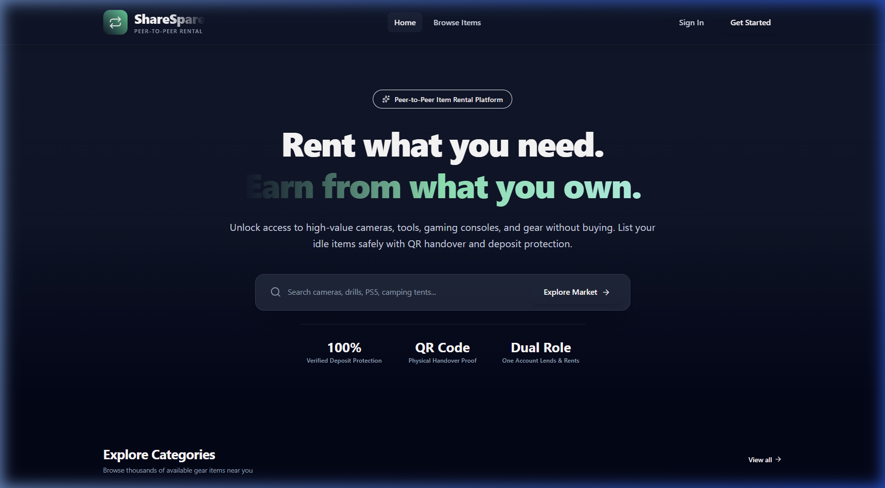
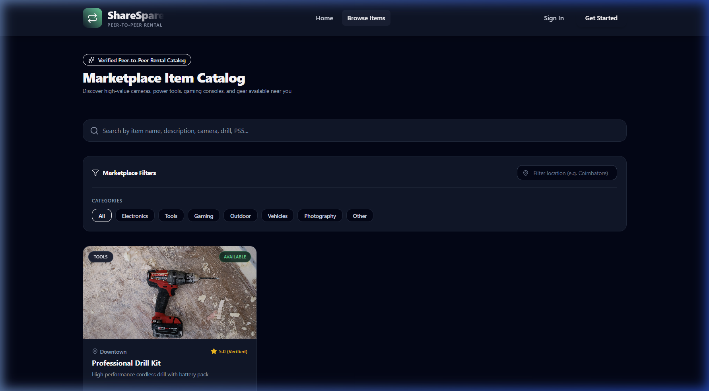
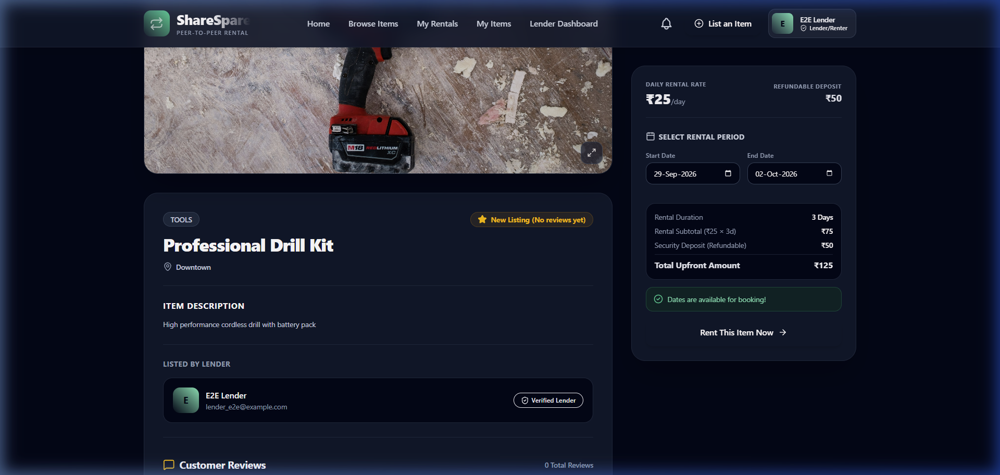
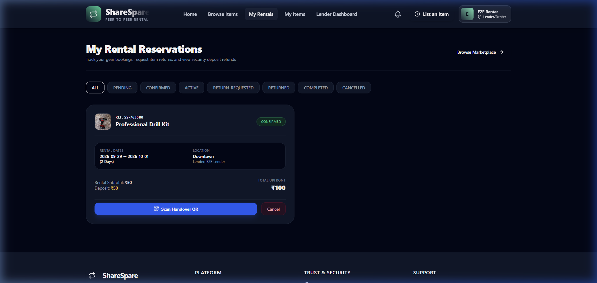
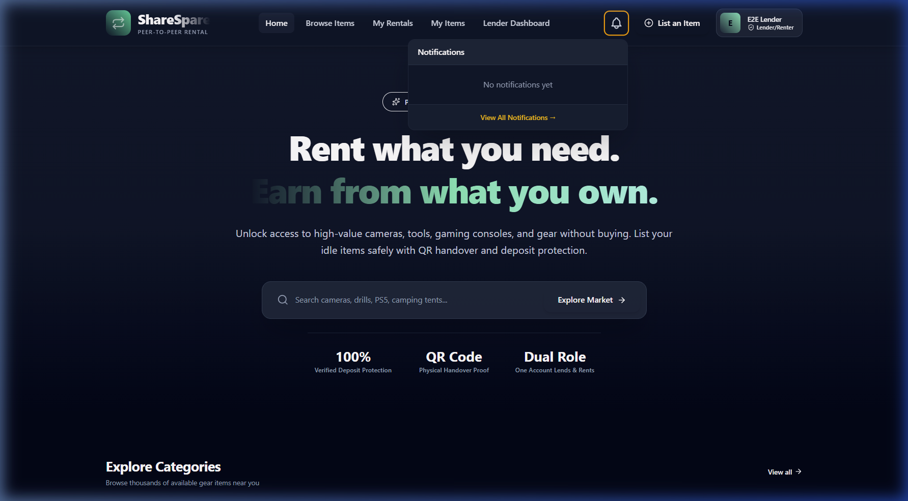
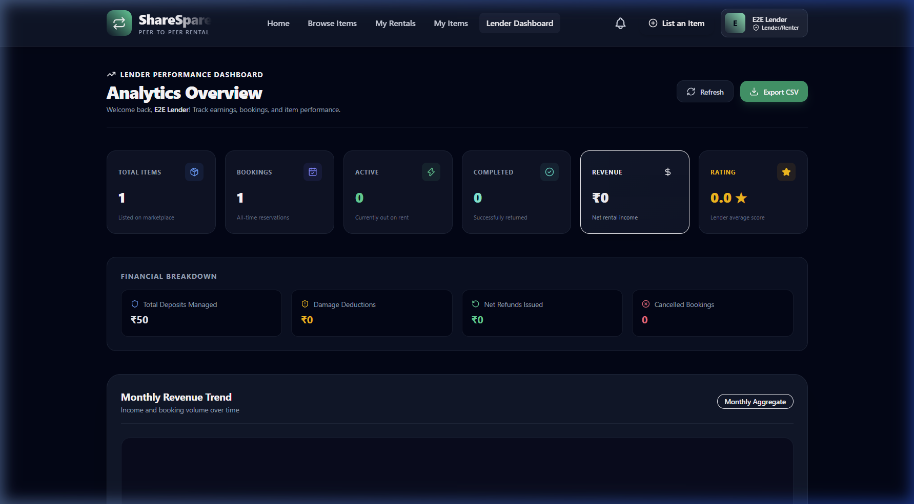
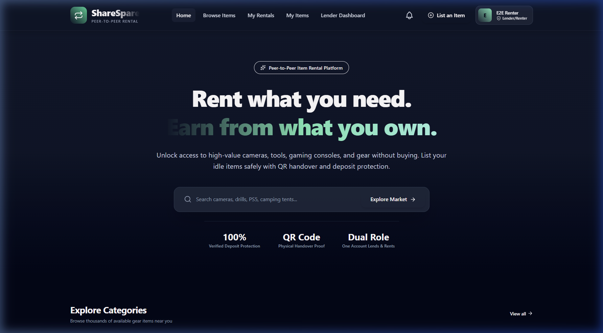

# ShareSpare

> A production-ready peer-to-peer rental and item-sharing platform.

[](https://spring.io/projects/spring-boot)
[](https://react.dev/)
[](https://www.oracle.com/java/)
[](LICENSE)
[]()

---

## 📋 Table of Contents

- [Overview](#-overview)
- [Key Features](#-key-features)
- [Tech Stack](#-tech-stack)
- [Architecture](#-architecture)
- [Rental Lifecycle](#-rental-lifecycle)
- [Screenshots](#-screenshots)
- [Getting Started & Local Setup](#-getting-started--local-setup)
- [Testing & Quality Assurance](#-testing--quality-assurance)
- [Security & Data Isolation](#-security--data-isolation)
- [License](#-license)

---

## 🌟 Overview

**ShareSpare** is a modern, full-stack peer-to-peer rental platform that enables users to list items they own (tools, electronics, outdoor gear, equipment) and rent items from others for designated timeframes.

The system manages the entire end-to-end rental lifecycle seamlessly:

$$\text{Listing} \rightarrow \text{Search} \rightarrow \text{Booking} \rightarrow \text{Payment} \rightarrow \text{QR Handover} \rightarrow \text{Active Rental} \rightarrow \text{Return} \rightarrow \text{Damage Inspection} \rightarrow \text{Refund} \rightarrow \text{Review} \rightarrow \text{Analytics} \rightarrow \text{Notifications}$$

---

## ✨ Key Features

- **JWT Authentication & User Management**: Stateless authentication with BCrypt password hashing and unified Lender/Renter account capabilities.
- **Item Listing & Search**: Full item CRUD with category tags, location search, daily rates, security deposit specifications, and multi-image support.
- **Booking Management & Date-Overlap Protection**: Real-time availability verification preventing double bookings for overlapping date ranges.
- **Payment & Security Deposits**: Upfront payment processing incorporating daily rental rates and refundable security deposits.
- **QR Code Handover Verification**: Secure token-based QR code generation for physical item handover verification (transitioning booking to `ACTIVE`).
- **Return & Damage Inspection**: Step-by-step return request, lender damage inspection, evidence photo uploads, and automatic deposit refund calculation.
- **Reviews & Ratings**: Verified review system for completed rentals with aggregate rating summary calculations.
- **Lender Analytics Dashboard**: Operational metrics, monthly revenue trends, item booking performance, and financial breakdowns.
- **Persistent Database Notifications**: Real-time REST notification system across 10 lifecycle events with unread badge counter, popover bell dropdown, and filterable notifications page.
- **User Data Isolation**: Server-side scoping ensuring strict privacy for bookings, damage reports, analytics, and notifications.
- **Responsive UI**: Premium dark-mode glassmorphic design tailored for desktop (1440px+), tablet (768px), and mobile (375px) viewports.

---

## 🛠️ Tech Stack

### Backend
- **Core**: Java 17, Spring Boot 3
- **Security**: Spring Security 6, JWT (JSON Web Tokens), BCrypt Password Encoder
- **Persistence**: Spring Data JPA, Hibernate ORM
- **Database**: H2 Database (in-memory for development/testing), MySQL ready
- **Testing**: JUnit 5, Mockito

### Frontend
- **Core**: React 18, JavaScript, JSX, Vite
- **Styling**: Vanilla CSS, Tailwind CSS (Custom Dark Mode & Glassmorphism design system)
- **HTTP Client**: Axios (with global JWT request/response interceptors)
- **Routing**: React Router DOM 6
- **UI Icons**: Lucide Icons
- **QR Functionality**: `html5-qrcode` & QR generation

> ⚠️ **Important Note**: The frontend is implemented **entirely using JavaScript/JSX. Zero TypeScript.**

---

## 🏗️ Architecture

```
┌─────────────────────────────────────────────────────────────┐
│                    React 18 Frontend                        │
│            (JavaScript / JSX / Axios / Tailwind CSS)        │
└──────────────────────────────┬──────────────────────────────┘
                               │ HTTP / REST API (/api)
                               ▼
┌─────────────────────────────────────────────────────────────┐
│               Spring Boot 3 Backend Server                  │
│  ┌───────────────────────────────────────────────────────┐  │
│  │ JwtAuthenticationFilter & SecurityContext             │  │
│  └───────────────────────────┬───────────────────────────┘  │
│                              ▼                              │
│  ┌───────────────────────────────────────────────────────┐  │
│  │ REST Controllers (/api/auth, /items, /bookings, etc.)  │  │
│  └───────────────────────────┬───────────────────────────┘  │
│                              ▼                              │
│  ┌───────────────────────────────────────────────────────┐  │
│  │ Service Layer (Business Logic & Transactions)          │  │
│  └───────────────────────────┬───────────────────────────┘  │
│                              ▼                              │
│  ┌───────────────────────────────────────────────────────┐  │
│  │ Spring Data JPA Repositories                          │  │
│  └───────────────────────────┬───────────────────────────┘  │
└──────────────────────────────┼──────────────────────────────┘
                               │ JPA / Hibernate
                               ▼
┌─────────────────────────────────────────────────────────────┐
│                   H2 / MySQL Database                       │
└─────────────────────────────────────────────────────────────┘
```

### JWT Authentication Flow
1. User logs in at `/api/auth/login` with email and password.
2. Server validates credentials via `AuthenticationManager` and issues a signed JWT token.
3. Client stores token in `localStorage` and attaches `Authorization: Bearer <token>` header on all requests.
4. Server `JwtAuthenticationFilter` validates token per request and establishes `SecurityContext`.

---

## 🔄 Rental Lifecycle

```mermaid
flowchart LR
    A[Register/Login] --> B[List Item]
    B --> C[Search]
    C --> D[Booking]
    D --> E[Payment]
    E --> F[QR Handover]
    F --> G[Active Rental]
    G --> H[Return Request]
    H --> I[Damage Inspection]
    I --> J[Refund]
    J --> K[Review]
    K --> L[Analytics & Notifications]
```



---

## 📸 Screenshots

| Landing Page | Browse Items |
| :---: | :---: |
|  |  |

| Item Details & Pricing | Booking & Payment Workflow |
| :---: | :---: |
|  |  |

| Notifications System | Lender Analytics Dashboard |
| :---: | :---: |
|  |  |

<div align="center">
  <h3>Mobile Responsive View</h3>
  
</div>

---

## 🚀 Getting Started & Local Setup

### Prerequisites
- **Java**: OpenJDK 17 or Oracle JDK 17
- **Node.js**: Node.js 18+ and `npm`
- **Build Tools**: Maven 3.8+ (or included Maven wrapper)

### 1. Clone the Repository
```bash
git clone https://github.com/BPranesh27/SpareHub.git
cd SpareHub
```

### 2. Start the Backend Server
```bash
cd backend
mvn spring-boot:run
```
*The backend server will start on `http://localhost:8080` with H2 in-memory database automatically initialized.*

### 3. Start the Frontend Application
```bash
cd frontend
npm install
npm run dev
```
*The Vite frontend application will start on `http://localhost:3000` (or `http://localhost:5173`).*

---

## 🧪 Testing & Quality Assurance

### Automated Backend JUnit 5 Tests
Run all backend unit and integration tests:
```bash
cd backend
mvn clean test
```

**Test Execution Results**:
- **Total Tests**: `104`
- **Failures**: `0`
- **Errors**: `0`
- **Status**: `BUILD SUCCESS`

### Frontend Production Build Audit
Verify the React production build:
```bash
cd frontend
npm run build
```
- **Build Output**: `0 errors`
- **Language Audit**: 100% JavaScript/JSX (0 `.ts` or `.tsx` files).

---

## 🔒 Security & Data Isolation

- **Password Security**: All user passwords are encrypted using BCrypt hashing before persistence.
- **Resource Ownership**: Every operational endpoint (booking approval, handover verification, damage inspection, analytics, notification management) enforces strict owner validation.
- **Data Scoping**: Notification and booking endpoints derive the authenticated user strictly from `SecurityContext.getAuthentication()`. Cross-tenant data access attempts return `401 Unauthorized` or `404 Not Found`.

---

## 📄 License

This project is licensed under the [MIT License](LICENSE).
